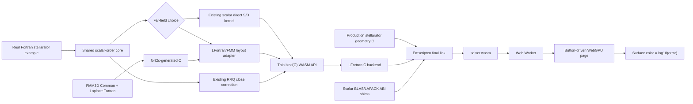

```text
qotential/
├── Makefile.lfortran                # isolated native LFortran build
├── src/                              # existing real solver sources
├── test/
│   └── stellarator_grf.f90           # existing executable, kept as thin driver
├── utils/                            # existing geometry support
└── web/
    └── stellarator/
        ├── fortran/
        │   ├── stellarator_grf_core_mod.f90
        │   ├── fmm3d_wasm_sources.txt
        │   ├── stellarator_wasm_api.f90
        │   └── wasm_sources.txt
        ├── native/
        │   ├── fmm3d_layout_adapter.c
        │   ├── fmm3d_c.h
        │   ├── geometry_layout_adapter.c
        │   ├── wasm_blas_shim.c
        │   └── wasm_api_adapter.c
        ├── src/
        │   ├── main.ts
        │   ├── data-schema.ts
        │   ├── solver-worker.ts
        │   ├── worker-utils.ts
        │   ├── wasm-loader.ts
        │   ├── renderer.ts
        │   └── colormap.ts
        ├── scripts/
        │   ├── build-lfortran.sh
        │   ├── build-fmm3d-wasm.sh
        │   ├── build-wasm.sh
        │   └── generate-w7x-modes.py
        ├── patches/
        │   ├── fort2c-allocate-stat.patch
        │   └── lfortran-c-backend.patch
        ├── test/
        │   ├── data-schema.test.ts
        │   ├── wasm-api-node.mjs
        │   └── worker-utils.test.ts
        ├── fixtures/
        │   └── native/               # small, versioned Fortran results
        ├── public/
        │   └── wasm/                 # generated artifacts; do not hand-edit
        ├── index.html
        ├── Makefile
        ├── package.json
        ├── vite.config.ts
        └── README.md
```

# Stellarator browser solver design

## Run the implemented page

The browser executable runs the real scalar Fortran path at a selected even
order from 4 through 16 in a Web Worker and renders either the built-in
stellarator or W7-X lattice with WebGPU; there is no TypeScript or WGSL
solver. The far field is selectable at runtime: serial FMM3D is the default,
and the existing blocked Direct evaluator remains available as the reference
path. FMM tolerances are `1e-3`, `1e-6`, `1e-9`, `1e-12`, and `1e-15`, with
`1e-3` as the default. The tolerance selector is ignored when Direct is
selected.

To view the currently built `public/wasm` artifact without recompiling it:

```sh
npm install
npm run dev
```

To rebuild the complete solver before opening the page, follow the toolchain
setup below and run `make serve` with `LF`, `FMM3D_SRC`, `FORT2C`, `LLVM_NM`,
and `EM_CACHE` configured. Open the URL printed by Vite and press **Run Fortran
solver**.

A current browser with WebGPU support is required. The static deployment
product is `dist/`; `vite.config.ts` uses a relative base so it can be hosted
below a repository subpath as well as at a domain root.

## Manually deploy to GitHub Pages

The public repository carries checksum-pinned prebuilt `solver.js` and
`solver.wasm` files. GitHub does not rebuild Fortran, run Emscripten, or run
the numerical tests during deployment. The deployment workflow only verifies
the committed checksums, builds the static TypeScript/Vite page, and publishes
`dist/`.

The workflow has only a `workflow_dispatch` trigger, so a commit or push does
not start it. For the first deployment, select **GitHub Actions** under
**Settings → Pages → Build and deployment → Source**. Then deploy manually:

1. Open **Actions** in the qotential repository.
2. Select **Deploy stellarator WebAssembly demo**.
3. Click **Run workflow**, select `main`, and confirm.

After the workflow succeeds, open
`https://haiszhu.github.io/qotential/`. No custom domain or server-side solver
is required; the committed WASM solver runs in the visitor's browser.

Useful numerical gates are:

```sh
LF=/path/to/patched/lfortran make parity
LF=/path/to/patched/lfortran make sanitize
```

That summary assumes the toolchain is already in place. On a clean machine it
is not, and the compiler has to be built first; see the next section.

### Truthful run log

Below the Run button is an append-only log that behaves like a package build.
It reports real progress from the running solver, not a timer estimate:

- Every Run clears the previous log; the completion, error, or cancellation
  lines from a run stay visible until the next Run begins.
- Each line originates in the real numerical stages (geometry, selected
  Direct or FMM3D Laplace GRF, close-target counting, RRQ correction, scatter,
  render, result). The
  event travels through LFortran-generated C and an Emscripten `EM_JS` callback
  bridge (`native/wasm_progress_bridge.c`) into the Web Worker.
- Direct and RRQ loops emit deterministic milestones every 2 percent plus
  exactly one final 100-percent event; the Worker additionally throttles
  ordinary lines to about 250 ms per stage. FMM3D has no trustworthy internal
  percentage callback, so it emits only begin and completion events with the
  measured FMM wall time. Stage boundaries and final events are never
  throttled.
- The final `[result]` GRF line is the solver's own returned value, and the
  elapsed-time line uses the Worker's own `performance.now()` measurement.
- Cancellation terminates the Worker and leaves one `[cancelled]` line; no
  synthetic completion is fabricated.
- The whole path is guarded by `BIESOLVER_WASM_PROGRESS`. Progress is
  observational: a missing or throwing handler can never fail or perturb the
  numerical solve, and native/OpenMP builds define no progress macro. Building
  the browser artifact with `WASM_PROGRESS=0` reproduces the pre-progress
  generated C and `solver.wasm` byte-for-byte.

## Bringing up the toolchain on macOS

Verified end to end on macOS 15 / Apple Silicon, 2026-08-07, from a machine
with none of this installed. Each numbered step is a command that ran.

Package prerequisites, none of which macOS supplies in a usable form:

| Need | Why | Install |
|---|---|---|
| `node`, `npm` | Vite, the parity harness | `brew install node` |
| `emscripten` | compiles the generated C to wasm | `brew install emscripten` |
| `bison` >= 3 | Apple ships 2.3 (2006); it rejects `bison -W` | `brew install bison` |
| `llvm` | `llvm-nm`, used to audit the wasm object | `brew install llvm` |
| `cmake`, `ninja` | configures and builds the pinned LFortran checkout | `brew install cmake ninja` |
| Python 3.12 | `build0.sh` calls bare `python`, absent since Catalina | `brew install python@3.12` |
| `uv` | installs the pinned, locally patched fort2c with Python 3.12 | `brew install uv` |

Homebrew keeps `bison` and `llvm` keg-only, so neither lands on `PATH`. That
is deliberate below rather than worked around with `brew link`.

**1. Clone LFortran at the pinned commit.**

```sh
git clone https://github.com/lfortran/lfortran ~/lfortran
cd ~/lfortran && git checkout bc9740b2d4a946e26418473262b19b06eb268427
```

**2. Give it a bare `python`.** `build0.sh` invokes `python`, not `python3`.
A virtualenv supplies one and pins the verified Python version:

```sh
cd ~/lfortran
"$(brew --prefix python@3.12)/bin/python3.12" -m venv .venv
source .venv/bin/activate
```

Keep the environment active for steps 3 and 4 — cmake re-runs `build0.sh`
itself.

**3. Configure, out of source, into `build/`.**

```sh
cd ~/lfortran && rm -rf build && \
  PATH="$HOME/lfortran/.venv/bin:$(brew --prefix bison)/bin:$PATH" \
  cmake -B build -G Ninja -DCMAKE_BUILD_TYPE=Release -DWITH_LLVM=yes \
    -DLFORTRAN_BUILD_ALL=yes -DWITH_LSP=no -DUSE_DYNAMIC_ZSTD=no \
    -DCMAKE_PREFIX_PATH="$(brew --prefix llvm)"
```

Three things here are not optional:

- **Out of source.** LFortran's own `build1.sh` configures in-source, which
  puts the binary at `src/bin/lfortran`. `scripts/build-wasm.sh` recovers the
  source tree by walking three directories up from the binary, so it requires
  exactly `<source>/build/src/bin/lfortran`.
- **Homebrew's bison ahead of Apple's.** `CMakeLists.txt` runs
  `find_program(BISON bison REQUIRED)` and passes the result into `build0.sh`,
  *overriding* any `BISON=` you export. The only lever is `PATH`.
- **`rm -rf build`.** A failed configure caches `BISON:FILEPATH=/usr/bin/bison`,
  and `find_program` will not search again while that entry exists.

`WITH_TARGET_WASM: no` in the configure summary is correct. That is LFortran's
own Fortran-to-wasm backend, which this project does not use — the path here is
Fortran to C via `--show-c`, then C to wasm via Emscripten.

**4. Build the compiler *and* its runtime.**

```sh
cd ~/lfortran && cmake --build build -j 8
```

Not `--target lfortran`. That target yields the binary without the intrinsic
modfiles, and the first real compile then fails with
`Module 'lfortran_intrinsic_iso_c_binding' modfile was not found`.

**5. Check the patched backend.**

```sh
~/lfortran/build/src/bin/lfortran --version
LF=~/lfortran/build/src/bin/lfortran test/probe-script.test.sh
```

`scripts/build-lfortran.sh <source>` wraps steps 4 and 5 and additionally
re-verifies the applied patch against `patches/lfortran-c-backend.patch`.

**6. Install the FMM3D and fort2c inputs.**

The browser build accepts FMM3D 2.0 or newer and records the exact source
commit in its cache stamp. The default location is `~/git/FMM3D`:

```sh
mkdir -p "$HOME/git"
git clone https://github.com/flatironinstitute/FMM3D.git "$HOME/git/FMM3D"
git -C "$HOME/git/FMM3D" describe --tags --always
```

fort2c is pinned because its generated ABI is part of this build. Install the
checked commit after applying the repository's allocation-status patch. Run
these commands from this README's directory:

```sh
git clone https://github.com/magland/fort2c.git "$HOME/fort2c"
git -C "$HOME/fort2c" checkout 7f7fda827260df4f7ff1bfcaf1c420e3e809ac7b
git -C "$HOME/fort2c" apply "$PWD/patches/fort2c-allocate-stat.patch"
uv tool install --force --python 3.12 "$HOME/fort2c"
fort2c --version
bash test/fort2c-allocate-stat.test.sh
```

If `fort2c` is not found after installation, run `uv tool update-shell`, open
a new shell, or add `$HOME/.local/bin` to `PATH`. Do not install an unpatched
PyPI/GitHub version in its place: the semantic probe deliberately rejects a
translator that reports successful `allocate(...,stat=ier)` after `malloc`
returns null.

On a machine where either checkout already exists, inspect its commit and
working tree before updating it. Do not blindly clone over or reset a checkout
that contains local work.

**7. Build the wasm and serve the page.**

```sh
npm install
LF=~/lfortran/build/src/bin/lfortran \
LLVM_NM="$(brew --prefix llvm)/bin/llvm-nm" \
EM_CACHE="$HOME/.cache/biesolver-emscripten" \
FMM3D_SRC="$HOME/git/FMM3D" \
FORT2C="$(command -v fort2c)" \
  make serve
```

`LLVM_NM` and `EM_CACHE` both exist because of macOS specifics:

- Homebrew's `llvm` is keg-only, so `llvm-nm` is not on `PATH`. Overriding the
  variable is preferred to prepending `/opt/homebrew/opt/llvm/bin`, which would
  shadow Apple's `clang`.
- The default cache is under `/tmp`, which on macOS is a symlink to
  `/private/tmp`. Emscripten builds its system libraries with paths computed
  relative to the cache, and the symlink breaks that arithmetic —
  `clang: error: no such file or directory:
  '../../../../opt/homebrew/Cellar/emscripten/.../gl.c'`. Any real,
  non-symlinked directory fixes it. `em-config CACHE` reports Emscripten's own
  default if you would rather use that.

Emscripten is deliberately *not* version-pinned the way LFortran and fort2c
are; 6.0.6 is what this was verified against. If a future release changes its
cache layout or system-library build, this step is where it will show.

The final `solver.wasm` is one module. LFortran translates the qotential and
geometry-side Fortran to C; fort2c translates only the serial FMM3D Common and
Laplace closure; Emscripten compiles and links both C families. gfortran is
used for the independent native FMM3D and solver references, while native
Clang validates fort2c output before the same generated C is sent through
Emscripten. Neither gfortran nor native Clang is embedded in the browser.

`public/wasm/`, `build-wasm/`, `dist/`, and `node_modules/` are generated and
ignored. The native truth fixture under `fixtures/native/` is versioned input
to the parity test, not browser output.

## Rebuilding after source changes

Run the commands in this section from `web/stellarator/` in the qotential
checkout. Once the patched compiler from
the preceding section exists, keep the machine-specific tool paths in the
shell used for development:

```sh
export LF="$HOME/lfortran/build/src/bin/lfortran"
export LLVM_NM="$(brew --prefix llvm)/bin/llvm-nm"
export EM_CACHE="$HOME/.cache/biesolver-emscripten"
export FMM3D_SRC="$HOME/git/FMM3D"
export FORT2C="$(command -v fort2c)"
```

On a new checkout, or after `package-lock.json` changes, install the exact
front-end dependency versions with `npm ci`. The normal complete rebuild is:

```sh
npm ci
make app
```

`make app` regenerates `public/wasm/solver.js` and `solver.wasm`, runs the
TypeScript tests, and creates the static site in `dist/`. It does not run the
long numerical parity suite.

The FMM3D Common/Laplace translation is cached in
`build-fmm3d/libfmm3d-wasm.a`. Its stamp covers the FMM3D commit, manifest and
source hashes, fort2c command/version and patch digest, runtime header,
Emscripten version, and FMM compile flags. A normal `make wasm` reports
`FMM3D_WASM_CACHE_HIT` when none of those inputs changed. Force only that
translation to rebuild with:

```sh
FMM3D_REBUILD=1 make wasm
```

Useful focused checks, ordered from the translator boundary to the complete
solver, are:

```sh
make fmm3d-test
bash test/fmm3d-fort2c-native.test.sh  # fort2c C compiled by native Clang
bash test/fmm3d-fort2c-wasm.test.sh    # same closure compiled by Emscripten
WASM_SKIP_W7X=1 node test/wasm-api-node.mjs
make parity                            # includes the longer W7-X FMM gate
```

The native reference for the original FMM3D checkout is separate from these
fort2c tests. Build and run an upstream Laplace test with gfortran first when
diagnosing a new FMM3D checkout; this distinguishes an upstream/native setup
problem from fort2c, Emscripten, or browser integration.

The browser owns the seven simplex-precomputation buffers explicitly. For each
solve it allocates `tgl`, `wgl`, `Dgl`, `w_bclag`, `Legmat`, `umatr`, and
`vmatr`; calls `_solver_simplex_precomp` once; passes the same pointers to
`_solver_run`; and frees every buffer in `finally`. The Fortran, C ABI, and
worker therefore use the same caller-owned interface. Any change to that
interface or its Fortran/C implementation requires rebuilding both
`public/wasm/solver.js` and `public/wasm/solver.wasm`.

The native `rrq_r64` entry point, `qol_rrq_mex`, the stage-by-stage MATLAB
`qol_rrq.m`, and the browser solver all require this same simplex input set.

The explicit workspace `deallocate` calls in `rrq_r64` and
`build_closepanel_precomp_r64` are currently part of the WASM correctness
contract. Standard Fortran automatically finalizes local allocatables when a
procedure returns, but the pinned LFortran C backend does not yet do so
reliably. Do not remove those calls without rebuilding the module and running
`WASM_SKIP_W7X=1 node test/wasm-api-node.mjs`; that gate performs repeated
solves and rejects continued WASM-memory growth after warmup.

Before committing regenerated prebuilt artifacts, refresh and verify their
checksum manifest:

```sh
cd public/wasm
shasum -a 256 solver.js solver.wasm > SHA256SUMS
shasum -a 256 --check SHA256SUMS
cd ../..
```

Commit the two solver artifacts and `SHA256SUMS` together. A manual Pages
deployment refuses to publish them if the checksum verification fails.

Use the smallest rebuild that matches the files changed:

| Changed files | Required action |
|---|---|
| `index.html`, `src/*.ts`, or `src/style.css` | A running `npm run dev` rebuilds the front end automatically; run `npm run build` before delivery. |
| Fortran in `fortran/`, the qotential/QuatApproximation/LineQuaaadrature source closure, `native/*.c`, `native/*.h`, or the WASM ABI/build scripts | Run `make wasm`, then reload the page. Add any new LFortran module to `fortran/wasm_sources.txt` in dependency order. |
| FMM3D checkout/source, `fortran/fmm3d_wasm_sources.txt`, fort2c command/patch, `native/fmm3d_c.h`, or FMM compile flags | Run `make wasm`; its cache stamp rebuilds `libfmm3d-wasm.a` automatically. Use `FMM3D_REBUILD=1 make wasm` to rule out a suspect cache. |
| `patches/lfortran-c-backend.patch` or `scripts/build-lfortran.sh` | Run `scripts/build-lfortran.sh "$HOME/lfortran"` first, then `make wasm`. If the pinned LFortran commit changed, update the LFortran checkout to the commit recorded by that script before rebuilding. |
| `package.json` or `package-lock.json` | Run `npm ci`, followed by `npm test` and `npm run build`. |
| Native fixtures or numerical reference values | Regenerate them only through the documented native parity workflow, review the numerical change, then run the full parity gate. Do not update a fixture merely to make a failing test pass. |

Progress reporting is enabled by default. Its explicit build switch is useful
when checking that instrumentation remains observational:

```sh
WASM_PROGRESS=1 make wasm   # normal browser deliverable
WASM_PROGRESS=0 make wasm   # solver without the progress callback
```

### Updating an existing checkout

After new web-solver features have been committed and pushed, update another
machine and rebuild generated artifacts locally:

```sh
# First switch to the branch containing the web-solver changes, if necessary.
git pull --ff-only
npm ci
make app
```

If the pull changed the LFortran patch or its pinned commit, update/rebuild the
compiler as described in the table before running `make app`.

### Confirming that the browser uses the new WASM

`solver.wasm` is loaded once per Web Worker. A Worker that has already run the
solver keeps its instantiated module, so rebuilding the file alone does not
replace the module in that Worker. After `make wasm`:

1. reload the page so it creates a new Worker;
2. use a hard reload if the browser still shows old behavior; and
3. restart `npm run dev` only if the development server itself was stopped or
   continues to serve an old public asset.

If the Run log shows only the final result and no geometry, direct, or close
stages, check whether the generated JavaScript contains the progress bridge:

```sh
printf 'WASM_PROGRESS=%s\n' "${WASM_PROGRESS-<unset>}"
if grep -q 'function biesolver_progress' public/wasm/solver.js; then
  echo BRIDGE_PRESENT
else
  echo BRIDGE_MISSING
fi
```

`WASM_PROGRESS=<unset>` is normal because the build defaults to progress on.
`BRIDGE_MISSING` is not normal for the standard deliverable: it means
`public/wasm/` contains an old artifact or was last built with
`WASM_PROGRESS=0`. These generated files are ignored by Git, so `git pull`
updates their sources but does not replace them. Rebuild explicitly:

```sh
WASM_PROGRESS=1 make app
```

Then verify that the command above reports `BRIDGE_PRESENT`, reload the page to
discard the previously instantiated Worker, and run the quick Node gate:

```sh
WASM_SKIP_W7X=1 node test/wasm-api-node.mjs | grep WASM_PROGRESS_ORDER_OK
```

If the Node gate prints `WASM_PROGRESS_ORDER_OK` but the page still has no
stage lines, use the browser console to check the asset actually served by
Vite or the deployed site:

```js
fetch('./wasm/solver.js')
  .then((response) => response.text())
  .then((source) => console.log(source.includes('onSolverProgress')))
```

It must print `true`. A false result identifies a stale served/deployed asset,
not missing Fortran progress. Ordinary percentage messages are throttled, but
stage boundaries and final 100-percent messages are never throttled; seeing
only the final result is therefore not explained by a fast Mac.

For an objective check, compare the artifact hash before and after rebuilding:

```sh
shasum -a 256 public/wasm/solver.wasm
make wasm
shasum -a 256 public/wasm/solver.wasm
```

A changed solver input normally changes the hash. An unchanged hash means the
edit did not reach the generated WASM path, or it was excluded by the active
preprocessor configuration. Inspect `fortran/wasm_sources.txt`, the generated
`build-wasm/stellarator_solver.c`, and the build flags before assuming the
browser cache is responsible.

For the production site, rebuild `dist/` after rebuilding WASM and verify that
Vite copied the same binary:

```sh
npm run build
cmp public/wasm/solver.wasm dist/wasm/solver.wasm
```

Then serve locally with `npm run dev`, or inspect the production bundle with
`npm run preview`. The quick numerical gate avoids the long W7-X case:

```sh
WASM_SKIP_W7X=1 node test/wasm-api-node.mjs
```

Before merging or deploying a numerical change, run the complete gate:

```sh
make parity
```

## Toolchain acknowledgements

This port depends directly on [LFortran](https://github.com/lfortran/lfortran),
[Emscripten](https://emscripten.org/),
[fort2c](https://github.com/magland/fort2c), and
[FMM3D](https://github.com/flatironinstitute/FMM3D). LFortran compiles the real
qotential/geometry-side Fortran dependency closure to C. fort2c translates the
serial FMM3D Common and Laplace closure. Emscripten compiles and links both C
families, the LFortran runtime, the production geometry C, and the explicit
ABI/layout shims into one `solver.wasm` and its JavaScript loader. FMM3D and
fort2c are Apache-2.0 projects; distribution notices belong in
`public/THIRD_PARTY_NOTICES.txt`.

This is intentionally not described as an ordinary stock-LFortran command.
The native LFortran target uses the separate `../../Makefile.lfortran`. The
browser target pins a specific LFortran source commit and applies the checked
`patches/lfortran-c-backend.patch` through `scripts/build-lfortran.sh` before
`scripts/build-wasm.sh` invokes the C backend. It independently pins and
patches fort2c, accepts FMM3D 2.0 or newer, records the exact FMM3D revision,
and crosses the row-major LFortran/column-major FMM3D boundary through a tested
C adapter. The dedicated sections below record why the native and browser
compilations are separate and how Emscripten crosses the array-layout and
BLAS/LAPACK boundaries.

## Purpose

Build both ends of the product first, then bridge them in small, testable
increments:

1. **Solver endpoint:** compile and run the real
   `../../test/stellarator_grf.f90` example with LFortran, fixing genuine
   portability problems in the existing Fortran sources and dependencies.
2. **Web endpoint:** retain the verified geometry page produced from the
   existing production geometry C and extend it with the final solver-data
   contract and field renderer. The earlier W7-X geometry endpoint remains
   useful validation evidence; the active solver page now supports both the
   built-in stellarator and W7-X.
3. **Bridge:** connect the real Fortran far-field evaluation—FMM3D by default,
   with Direct retained as a reference—and RRQ close correction to that page
   through generated C and Emscripten.

The final authority is always the existing Fortran numerical implementation.
TypeScript and WebGPU may transport and display its results; they must not
silently recreate the solver from its formulas.

Unless stated otherwise, paths in this document are relative to this README's
directory, `web/stellarator/`. Paths beginning with `../../` are relative to
the qotential root.

## Approved first browser executable

The browser executable is deliberately serial and accepts its discretization
at runtime:

- user-supplied positive integer `mp` and `np` (page defaults: `12` and `36`);
- selected `order` from `4, 6, 8, 10, 12, 14, 16` (page default: `4`);
- selected `surface`: the built-in stellarator, or W7-X from its 288 checked
  VMEC modes with curvature-refined charts (`ichart=1` chart geometry);
- for W7-X, a user-supplied positive `restol` (page default `1e-1`); the
  curvature criterion runs at the selected solve order, the chart cap is
  `200,000`, and exceeding it returns a clean error instead of truncating;
- selected far-field kernel `FMM` or `Direct` (page default: `FMM`); FMM
  accepts exactly `1e-3`, `1e-6`, `1e-9`, `1e-12`, or `1e-15` (page default:
  `1e-3`), while Direct explicitly ignores that selection;
- a source count whose 64-by-`nsrc` direct block would exceed the allocator's
  512 MiB single-request threshold is rejected with public status `215` before
  the large source and direct-work arrays are allocated (the preflight runs
  after geometry fixes `ntri`/`nsrc`, so Gauss/Vioreanu and chart data are
  already allocated); this guard applies only to Direct, while the FMM layout
  adapter separately overflow-checks its O(N) interleaving buffers;
- `isimd=0`, `ichart=1`, adaptive far-field refinement disabled;
- the FMM path calls the real serial `lfmm3d_t_cd_p` Common/Laplace closure;
- the Direct path calls the existing Fortran `lap3dsdlpmat_r64` in target
  blocks;
- the existing `rrq_r64` path supplies the close correction;
- calculation runs in a Web Worker after a page button is pressed; and
- the selected surface is colored by
  `log10(max(abs(u_i)/max(abs(ubn)), 1e-16))`.

The page also reports the maximum GRF relative error, source-node and render-face
counts, and total browser execution time. Progress text identifies runtime
loading, the atomic solve, and render preparation without pretending that the
adapter state transitions are separately timed numerical phases. SIMD,
pthreads, and WebGPU compute remain later optimizations.

While the atomic WASM call is running, the same button becomes **Cancel solve**.
Cancellation terminates the dedicated Worker, discards its private WASM memory,
and creates a fresh Worker for the next run, so no partial numerical state can
reach the renderer.

### Numerical path

The shared core preserves the selected-order setup in `stellarator_grf.f90`:

- `hdim = order*(order+1)/2`, `nquad = order+2`, `orderff = order+2`;
- `exterior=.true.`, `distff=1.4`, `ichart=1`, `isimd=0`;
- Gauss and Vioreanu data come from the existing quadrature modules;
- built-in stellarator nodes, normals, weights, and tangents come from the
  existing production geometry implementation; and
- `ub=f_harm(sx)` and `ubn=snx dot gradf_harm(sx)` use the functions moved
  from the existing example without changing their formulas.

For FMM, form the same charge and dipole densities as the native example and
call `lfmm3d_t_cd_p` with sources also used as targets. FMM3D supplies the
`1/(4*pi)`-normalized charge-plus-dipole far field and its existing self-term
convention. For Direct, use consecutive target blocks of 64 nodes (or the
remaining tail), call the existing `lap3dsdlpmat_r64` over every source node,
and accumulate

```text
u(i) = sum_j(As(i,j)*ubn(j) - Ad(i,j)*ub(j)).
```

The Direct kernel's coincident-pair zero is retained. Both choices then run the
same panel-neighbor selection and `rrq_r64` correction as the native example,
adding

```text
(S-RawSLP)*ubn - (K-RawDLP)*ub
```

for each close target. No full `N x N` matrix is retained. The native Direct
reference and WASM Direct build use the same target block size and summation
order for their strict parity test. FMM is checked against Direct independently
in native and WASM builds; RRQ is identical in both paths.

The returned point field is
`log10(max(abs(u(i))/maxval(abs(ubn)), 1e-16))`; the reported scalar GRF error
is `maxval(abs(u))/maxval(abs(ubn))`. `u`, `ubn`, and the unfloored ratio remain
available to parity tests in 64-bit buffers even though only the log field is
sent to the GPU display buffer. If `u`, `ubn`, or their scale is non-finite, or
if `maxval(abs(ubn)) <= 0`, the solver returns an error instead of rendering.
Finite ratios below `1e-16`, including exact zero and floating-point underflow,
display as `-16`.

## What exists now

The parameterized scalar browser case now crosses the entire pipeline:

```text
shared real Fortran core
    -> patched LFortran C backend
FMM3D Common + Laplace closure
    -> pinned and patched fort2c
both generated-C families
    -> explicit descriptor/layout and scalar BLAS adapters
    -> Emscripten solver.wasm
    -> atomic Web Worker API
    -> transferable mesh/field buffers
    -> interactive WebGPU stellarator rendering
```

The frozen Direct native fixtures use `mp=12`, `np=36`:

| surface | order | restol | panels | source nodes | native GRF error | fixture SHA-256 |
|---|---:|---:|---:|---:|---:|---|
| built-in | 4 | — | 1,110 | 11,100 | `1.3426854478863922e-3` | `2cbdae35d358bd1142ba710b0a38b5f52bb7804f9487634f1076fc19835b9528` |
| built-in | 6 | — | 1,110 | 23,310 | `5.5657723688047424e-2` | `1eef8626a7fab160278c550d101ffdf8f1876292768e7c1a1c213fb67a5ad9ea` |
| W7-X | 6 | `1e-1` | 5,500 | 115,500 | `2.3159388661226281e-3` | `9dc62c366876d619a5b9ffea7f02947695dbf824c85630f62b62f76fdcbc22fc` |

W7-X mesh resolution is a user decision through `restol`; the measured
trade-off at `mp=12`, `np=36`, mesh criterion at the solve order:

| order | restol | charts | N | native GRF |
|---:|---:|---:|---:|---:|
| 6 | `3e-1` | 1,376 | 57,792 | `1.36e+00` (ridges unresolved) |
| 6 | `1e-1` | 2,750 | 115,500 | `2.32e-03` |
| 6 | `3e-2` | 4,823 | 202,566 | `6.01e-04` |
| 6 | `1e-2` | 8,441 | 354,522 | not measured |

The `3e-1` row is why the default is `1e-1`: one refinement decade separates
an unresolved geometry from a meaningful error field.

The Node gate compares Direct order-4 geometry, normals, weights, boundary data,
render lattice, topology, field, and GRF values against native truth with
field-specific tolerances and deterministic hashes. The order-6 and W7-X
smoke/parity gates also exercise FMM. They require exact topology, finite
fields, and an FMM-versus-Direct difference bounded by the selected FMM
tolerance in each toolchain. Cross-toolchain FMM validation compares the FMM
increment relative to each toolchain's own Direct result, so an existing
LFortran/gfortran close-evaluation baseline difference is not falsely
attributed to FMM3D. This is tolerance parity, not bitwise native/WASM parity;
native fixture generation itself must remain bit-for-bit repeatable. The
order-6 fixture records current coarse-grid behavior and is not a convergence
claim. An independently built `-O1 -fsanitize=address` module also exercises
the integrated module.

## Non-negotiable source rule

The browser solver must be produced from the real Fortran source graph:

```text
existing Fortran solver and dependencies
    -> portable source fixes where the selected translator exposes incompatibilities
    -> LFortran C backend for qotential and fort2c for FMM3D
    -> generated C plus the explicit layout adapter
    -> Emscripten and required numerical libraries
    -> solver.wasm
```

Allowed additions are integration code, not alternative mathematics:

- a thin `bind(C)` Fortran API;
- build scripts and an ordered source manifest;
- checked integer-width or calling-convention adapters;
- browser worker, loader, rendering, and UI code;
- a new example driver when it is genuinely needed to exercise an interface;
  and
- conditional portability changes that remain tested with the native build.

The existing `stellarator_grf.f90` program and the WASM API must not grow two
copies of the full-surface orchestration. Extract that orchestration with a
minimal move into `fortran/stellarator_grf_core_mod.f90`; keep the existing
program as a thin command-line driver, and make both the native executable and
`fortran/stellarator_wasm_api.f90` call the same public core routine. The core
routine, in turn, continues to call the existing qotential,
QuatApproximation, LineQuaaadrature, geometry, RRQ, and BLAS/LAPACK routines.

The first approved small browser case replaced the far-field FMM3D call with a
blocked use of the existing Fortran `lap3dsdlpmat_r64`. That Direct path remains
an intentional reference implementation, not a second mathematical solver. The
current default path links the real serial FMM3D Common/Laplace closure, and
both paths use the same density construction, quadrature weights, self-term
meaning, and RRQ correction. Direct remains available in native and WASM builds
so the FMM contribution can be tested without conflating compiler baselines.

The following do **not** satisfy the design:

- translating RRQ, quadrature, direct kernels, or the boundary-integral solver into
  TypeScript;
- writing a new WebGPU solver that merely resembles the Fortran implementation;
- copying or reimplementing solver mathematics or full-surface orchestration in
  a new Fortran module instead of extracting and sharing the existing path;
- replacing a compiler incompatibility with fake numerical output; or
- treating a simplified example as proof that the complete solver compiles.

If an existing source construct is incompatible with LFortran, first reduce the
failure to a small reproducer, then make the narrowest portable source change.
The same numerical test must continue to pass with gfortran and LFortran.

## Why the endpoints were built first

Starting from the middle couples compiler discovery, ABI design, browser memory,
rendering, and deployment into one failure surface. The two-endpoint design
separates those risks:

- Endpoint A proves that LFortran can compile the actual solver dependency
  closure and that portability edits preserve numerical results.
- Endpoint B proves the real W7-X geometry generation, browser memory transfer,
  static page build, and native/WASM geometry parity independently of the
  solver compiler work. That earlier endpoint remains validation evidence; the
  current integrated page can select the built-in stellarator or W7-X.
- Each bridge stage replaces exactly one temporary boundary while both ends
  remain runnable.

Earlier fake-sphere scaffolding is not part of the approved executable path.
The checked W7-X geometry implementation was the earlier browser data source;
the active solver ABI now selects either supported surface and computes its
field on demand.

## Endpoint A: real solver under LFortran

### Current native status (2026-08-07)

The compile-and-run part of Endpoint A now passes with LFortran 0.64.0. The
separate `../../Makefile.lfortran` leaves every existing Makefile untouched and
writes all of its generated files to `../../build-lfortran/`:

```sh
cd qotential
make -f Makefile.lfortran LF=/path/to/lfortran stellarator
OMP_NUM_THREADS=1 NCASE=1 ISIMD=0 NTHREAD=1 PRADAPTIVE=0 \
  make -f Makefile.lfortran LF=/path/to/lfortran run
```

The real case 1 example links, runs, and produces `GRF max rel err =
2.605E-04`, matching the gfortran build. This is a native LFortran milestone,
not yet a WebAssembly build: it still links native FMM3D, OpenBLAS, OpenMP, and
compiler runtime libraries. The separate browser build replaces those native
dependencies as described below; it does not change what this native target
proves.

### Baseline

Preserve a gfortran baseline for `../../test/stellarator_grf.f90`, including
input parameters, field arrays, maximum relative error, and repeatability for
the cases being ported. Timing may differ; numerical meaning may not.

The current example reaches:

- qotential's `lap3d_close_mod` and `patch_refine_mod`;
- sibling QuatApproximation and LineQuaaadrature modules;
- the stellarator geometry C helpers;
- BLAS/LAPACK;
- FMM3D; and
- OpenMP timing and parallel regions.

The first LFortran milestone is not merely parser success. Its fixed gate is the
current case 1 configuration—order 4, `mp=24`, `np=72`, `isimd=0`, `ichart=1`,
and `iadap=0`—run from the qotential test directory as:

```text
OMP_NUM_THREADS=1 ./build/stellarator_grf 1 0 1 0
```

It is complete when the real example builds, links, runs that case, and matches
the frozen gfortran baseline.

Before any LFortran portability edit, run the gfortran baseline three times and
export the compared arrays plus GRF result into a versioned fixture. Store each
array's maximum magnitude and repeat spread. Freeze its comparison rule in the
fixture metadata using `scale=max(1,max(abs(array)))`, an absolute tolerance no
smaller than `100*epsilon*scale`, and a relative tolerance no smaller than
`100*epsilon`; increase either only to cover ten times a measured three-run
baseline spread. Once recorded, a tolerance cannot be relaxed to make a
portability change pass without an explicit numerical review and a new fixture
version.

### Compatibility policy

Classify every failure as parser, semantic analysis, code generation, runtime,
linking/ABI, or unsupported dependency behavior. Record the failing file and a
minimal reproducer before changing numerical code.

Preferred fixes are standard-conforming Fortran accepted by both compilers.
Compiler-specific preprocessing is a last resort and must isolate integration
behavior rather than duplicate an algorithm. A new LFortran-oriented example
driver is acceptable for incremental testing, but it does not replace the final
`stellarator_grf.f90` parity gate.

`../../Makefile.lfortran` compiles the source closure rather than consuming
gfortran-generated `.mod` files. It derives repository paths from its own
location, uses a separate build directory, and keeps dependency order explicit.
The `LF`, `FMM3D_DIR`, `OPENBLAS_DIR`, and `LIBOMP_DIR` inputs remain
overridable so a clean checkout does not depend on one developer's absolute
paths.

## Endpoint B: verified W7-X geometry page (historical bridge)

An earlier standalone `geometry/` prototype supplied real W7-X geometry from
`../../utils/stellarator_geo_mex.c`, compiled directly with Emscripten. The
prototype page is not shipped here; the production geometry source and its
W7-X parity fixture are retained by the main solver application. That earlier
endpoint established the user-facing requirements:

- a raw WebGPU surface renderer;
- orbit, pan, zoom, reset, and resize behavior;
- scalar-field and colormap-range controls;
- status, progress, error, and timing panels;
- a Web Worker message path so later solver work cannot block interaction;
- a useful unsupported-browser message; and
- a reproducible static Vite build that works under a repository subpath.

This endpoint established that a clean Emscripten build could be deployed to a
static HTTPS host such as GitHub Pages and used interactively without a custom
domain. The current page has moved beyond this bridge: its button executes
`solver.wasm` and displays the selected built-in or W7-X field.

## Stable data contract

`src/data-schema.ts` is the seam between the two endpoints. A versioned
`StellaratorDataset` should carry:

- mesh dimensions and parameter metadata;
- node positions and normals;
- panel or triangle connectivity;
- quadrature weights when available;
- named scalar fields with units and suggested display ranges;
- analytic values, numerical values, and pointwise errors when available;
- near/far classifications when available;
- producer identity (`native-fixture` or `wasm`); and
- geometry, solve, transfer, and rendering timings when applicable.

The native fixture loader and WASM worker must both produce this same contract.
Fields not available at an early stage are absent by schema, not filled with
misleading zeroes.

The delivered display contract is intentionally smaller than this original
design envelope: it transfers counts, GRF error, total elapsed time,
`Float32Array` positions and log-error values, and `Uint32Array` triangles.
The 64-bit solver and parity arrays remain available through the raw WASM copy
API and are compared in Node, not sent to WebGPU.

Keep solver and parity arrays as `Float64Array`. Because WebGPU vertex formats
are normally 32-bit, `renderer.ts` may create a `Float32Array` display copy;
that conversion must never be used for numerical validation.

## Bridge ladder

### Bridge 1: real native fixture

Add a deterministic export mode around the native Fortran example. Store one
small fixture under `fixtures/native/` with provenance: source revision,
compiler, parameters, dimensions, array layout, and tolerances.

Load that fixture into the already working web page and render the real
stellarator surface and fields. This proves the data contract and visualization
with real solver output before any browser compilation is involved.

This bridge may remain as a demo/fallback mode, but it is not the final
on-the-fly computation path.

### Bridge 2: production geometry in WASM (complete)

Compile the existing production `../../utils/stellarator_geo_mex.c` directly
with Emscripten. It already exposes its non-MATLAB compute core behind the
existing preprocessor boundary. The checked endpoint matches its native build
for topology, all geometry fields, area, and volume. The final worker may link
this object into `solver.wasm` or call a separately built geometry module, but
it must preserve the same validated arrays and tolerances.

### Bridge 3: one real solver slice in WASM

Compile one close-panel/RRQ case from the existing Fortran modules. Include its
real transitive dependencies rather than translating the routine. Compare every
returned numeric array with the native LFortran and gfortran results.

This stage establishes allocation, repeated calls, complex arithmetic,
BLAS/LAPACK linkage, error propagation, and the browser worker ABI before a
full-surface solve is attempted.

### Bridge 4: full low-resolution solver

Move the actual full-surface dependency closure into the supported WASM build.
The delivered interface accepts positive runtime `mp` and `np` and even orders
4 through 16, with `isimd=0`, `ichart=1`, and adaptive refinement disabled.
The shared core selects the serial FMM3D Common/Laplace closure or blocked
calls to the existing scalar `lap3dsdlpmat_r64` for far-field evaluation, then
uses the existing `rrq_r64` for close correction.

The browser gate is complete only when clicking **Run solver** starts the Web
Worker, runs the selected case on the fly, returns the built-in stellarator
or W7-X mesh and residual, colors the surface by `log10(error)`, and reports the
numerical/timing summary. Repeated-call parity and stable post-warmup memory are
checked in Node.

FMM3D is now the default far-field choice and Direct remains selectable. SIMD,
production-resolution grids, and parallel WASM remain outside this gate. Order
6 has native and WASM smoke/parity coverage. Orders 8 through 16 are selectable
experiments until equivalent regression evidence is added.

## WASM build and numerical libraries

The supported browser build is:

```text
Fortran sources listed in fortran/wasm_sources.txt
    -> LFortran C backend
FMM3D sources listed in fortran/fmm3d_wasm_sources.txt
    -> pinned, patched fort2c
    -> cached libfmm3d-wasm.a
both paths plus thin ABI/layout support
    -> Emscripten
    -> public/wasm/solver.wasm and loader
```

Direct LFortran-to-WASM remains an optional compiler probe, not a second
production pipeline.

For the scalar browser target, link small serial implementations of only the
required `dgemm`, `zgemm`, and `dgesv` entry points. These are ABI shims, not
solver replacements. They must:

- accept the exact 64-bit integer and complex signatures emitted by the
  Fortran interfaces;
- document and test the LFortran C backend's descriptor/layout convention;
- reproduce the native reference within the fixture tolerance; and
- be reentrant and free of hidden global workspaces.

Optimized BLIS/libFLAME WASM libraries remain a later performance option. They
are unnecessary for proving the small executable and would add an independent
ABI and build surface before correctness is established.

The scalar-only build defines a portability guard that removes SIMD dispatch
branches and external SIMD symbols from this target. Native builds retain the
existing SIMD source and behavior. The same guard removes OpenMP regions and
`omp_lib` calls from the browser target; it does not alter the native default.

### Array-layout boundaries

LFortran's current C backend lowers multidimensional Fortran arrays in
row-major order, while the production geometry C entry points and conventional
Fortran BLAS/LAPACK ABIs expect column-major storage. Internal generated-C
calls may remain row-major, but every external boundary must be explicit:

For a rank-2 `A(n1,n2)` with one-based indices, the generated-C side uses
`(i1-1)*n2 + (i2-1)` and the Fortran/external side uses
`(i1-1) + n1*(i2-1)`. Adapters implement these formulas directly.

| Boundary | v1 rule |
|---|---|
| generated core ↔ production geometry C | wrapper transposes all rank-2 inputs and outputs, including `Dgl`, `uvs`, `sx`, `snx`, `rts`, `rps`, `uvbd`, and chart outputs |
| generated core ↔ scalar BLAS/LAPACK | shims interpret the exact layout and transpose flags emitted by LFortran; focused non-square tests prove every operand and result |
| generated core ↔ fort2c FMM3D | adapter validates LFortran descriptors and interleaves planar `source(3,N)`, `target(3,M)`, and `dipvec(3,N)` into Fortran column-major storage; equal dimensions alone never imply source/target aliasing |
| WASM ↔ worker | checked flat copy functions publish documented interleaved positions and triangle indices; solver arrays remain 64-bit until the renderer creates its display copy |

No adapter may infer layout from a square or symmetric test matrix. Each gate
uses non-square, nonsymmetric sentinels, and the final parity test compares the
complete real arrays.

## WebGPU's role

WebGPU can render and compute, but generated Fortran WASM does not execute
directly as a WebGPU shader. The initial and supported architecture therefore
runs the real solver as WASM on the browser CPU and uses WebGPU for rendering.

After full parity, profiling may justify a WGSL implementation of one measured
hot kernel. Such a kernel is an optional accelerator only if:

- the authoritative Fortran/WASM implementation remains available as fallback;
- inputs and outputs use the same documented contract;
- automated parity tests cover representative and edge cases; and
- the speedup exceeds transfer and shader-dispatch overhead on named browsers.

There is no goal to rewrite the complete solver in WebGPU.

## Browser execution and memory

Run the solver in one Web Worker so camera and UI work remain responsive. Begin
with single-threaded WASM. WASM pthreads are a later optimization because they
require `SharedArrayBuffer`, a fixed/shared memory strategy, and COOP/COEP
deployment headers.

Use caller-provided buffers or bounded copy exports at the Fortran API. Do not
retain JavaScript views across possible WASM memory growth. The worker should
copy final results into transferable buffers and send one versioned response to
the main thread.

Every request carries an identifier, module URL, validated `mp` and `np`, a
validated even order, selected surface/restol, selected kernel, and one of the
five supported FMM tolerances. Every response carries the request identifier
and either progress, one completed dataset, or a structured error.

JavaScript calls `_solver_run(mp,np,order,surface,restol,kernel,fmmTolerance,...)`
with the caller-owned simplex-precomputation buffers, then queries result sizes
and copies positions, connectivity, `u`, `ubn`, and log-error through checked
flat-buffer functions. Thin handwritten C adapters unpack LFortran descriptors
and cross external array-layout boundaries, but contain no solver mathematics.
They return nonzero status codes for allocation, dimension, FMM, or solver
failures. The Worker reports total elapsed time plus truthful stage events; the
WASM build does not depend on OpenMP or native `cpu_time`/`system_clock`
behavior.

The solve is one synchronous WASM call. Cancellation therefore terminates the
dedicated Worker, discards its private WASM memory, and creates a fresh Worker
for the next run. Each completed run transfers fresh display buffers. Node
tests call the same WASM module repeatedly, compare native tolerances and field
hashes again, and require memory to stop growing after warmup.

## Validation strategy

Correctness progresses through paired gates:

| Gate | Producer A | Producer B | Required comparison |
|---|---|---|---|
| Native compiler | gfortran case 1 | LFortran case 1 | dimensions, arrays, GRF error, repeats |
| Data contract | native fixture | browser loader | shape, layout, metadata, finite values |
| Geometry WASM | native production C | browser WASM | positions, normals, weights, connectivity |
| Solver slice | native Fortran | browser WASM | all returned fields and status codes |
| Scalar full solve, order 4 | native direct case (`12x36`) | browser WASM | all stored fields, mesh, log-error, GRF, hashes, repeat |
| Scalar smoke/parity, order 6 | native direct case (`12x36`) | browser WASM | GRF, topology, render positions, aggregate log-error metrics |
| FMM translation | native Clang direct reference | fort2c closure under native Clang and Emscripten | finite charge-plus-dipole result, `1/(4*pi)` normalization, layout negative control |
| Integrated FMM | native and WASM Direct | native and WASM FMM | exact topology; each FMM-Direct difference and the cross-toolchain FMM increment remain within the selected tolerance envelope |
| FMM lifecycle | repeated calls in one WASM module | post-warmup memory samples | stable memory, deterministic status/result, no silent fallback to Direct |

Each field must have explicit absolute and relative tolerances. Rendering images
are not numerical evidence. Renderer tests verify finite GPU buffers, expected
topology, interaction, and graceful WebGPU failure; solver tests compare the
original 64-bit arrays.

Every compatibility change must run the relevant native gfortran and LFortran
tests. Every bridge change must keep the previous bridge runnable until the new
parity gate passes.

## Deployment

The single-threaded first release is an ordinary static site and can be hosted
on GitHub Pages or another HTTPS static host without buying a domain. All asset
URLs must work under a repository subpath.

If pthreads are introduced later, hosting must provide COOP and COEP headers.
That is a deployment change and cannot be assumed merely because the
single-threaded static build works.

## Delivery milestones

1. **Native truth:** gfortran baseline is recorded; real `stellarator_grf` builds
   and runs under LFortran with portable source fixes.
2. **Geometry endpoint:** production W7-X geometry builds in WASM and passes
   native parity as a historical bridge.
3. **Real display:** the same site renders a versioned native Fortran fixture.
4. **Real geometry display:** the verified geometry output is rendered through
   the stable data contract.
5. **Real solver slice:** one existing RRQ/close-panel path runs in WASM with
   native parity.
6. **Real scalar executable:** the button runs runtime `mp`, `np`, and selected
   even order through a Web Worker, using the Direct Fortran kernel plus RRQ,
   and displays the selected surface's `log10(error)` field. Order 4 has full
   native parity and order 6 has a smoke/parity fixture.
7. **Serial FMM3D far field:** the same executable defaults to the real FMM3D
   Common/Laplace closure translated by fort2c, retains Direct as a runtime
   reference, and exposes the five validated FMM tolerances.
8. **Measured optimization:** only after profiling, evaluate larger grids,
   SIMD, higher orders, pthreads, or a parity-checked WebGPU kernel.

## Definition of done

- The browser solver is compiled from the real Fortran source graph, with only
  documented portability and ABI adapters.
- The native direct executable and browser WASM agree for the frozen order-4
  `mp=12`, `np=36`, `isimd=0` case, including repeated calls in one module; the
  frozen order-6 case passes its documented smoke/parity checks.
- The FMM3D Common/Laplace closure passes its native-Clang and Emscripten
  translation probes, and integrated FMM-versus-Direct gates cover the
  documented built-in and W7-X cases without changing RRQ.
- The production page contains no TypeScript or WGSL reimplementation of the
  qotential solver.
- Clicking the page button runs the solver without blocking interaction and
  displays the real geometry colored by `log10(error)`, plus GRF and timings.
- A clean checkout can reproduce native, WASM, test, and static-site builds with
  documented compiler versions and repository-relative paths.
- The first release deploys over HTTPS without a custom domain.
